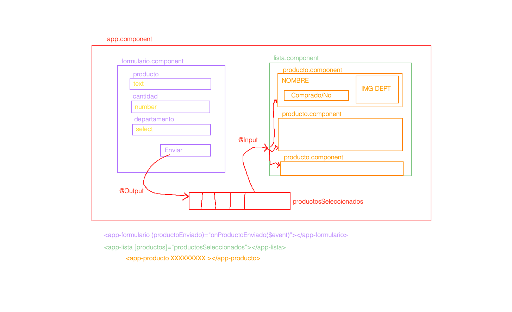

---
### General

- Importar Bootstrap
    - npm install bootstrap
    - Incluirlo en el array styles del fichero angular.json (node_modules/bootstrap/dist/css/bootstrap.min.css)
- Creación de los componentes (Formulario, Lista, Producto)
- Incluir FormsModule dentro de nuestro proyecto - ngModel
- Creación de la estructura general de nuestra app dentro de AppComponent HTML

### FormularioComponent

- Creación del formulario HTML - ngModel
- Comprobar si al pulsar enviar, recuperamos todos los campos del formulario
- Crear el @Output
- Enviar el producto creado mediante el @Output hacia el componente padre

### AppComponent

- Recuperar la información que nos envía el Formulario
- Insertamos el nuevo producto dentro del array productosSeleccionados

### ListaComponent

- Creamos el @Input **productos**
- Iteramos el array **productos** y generamos, por cada elemento del array **UN COMPONENTE <app-producto>, AL CUAL LE PASAMOS EL ELEMENTO DE LA ITERACIÓN**

### ProductoComponent

- Maquetamos un producto (Mostrar la imagen a través de ngSwitch)
- Recibimos a través de @Input los datos del producto a mostrar
- Al pulsar el botón, marcamos el producto como comprado.

## MEJORAS

- Borrar los productos de la lista
- Filtrar por categoría
- Buscar por Nombre
- Ordenar por cantidad